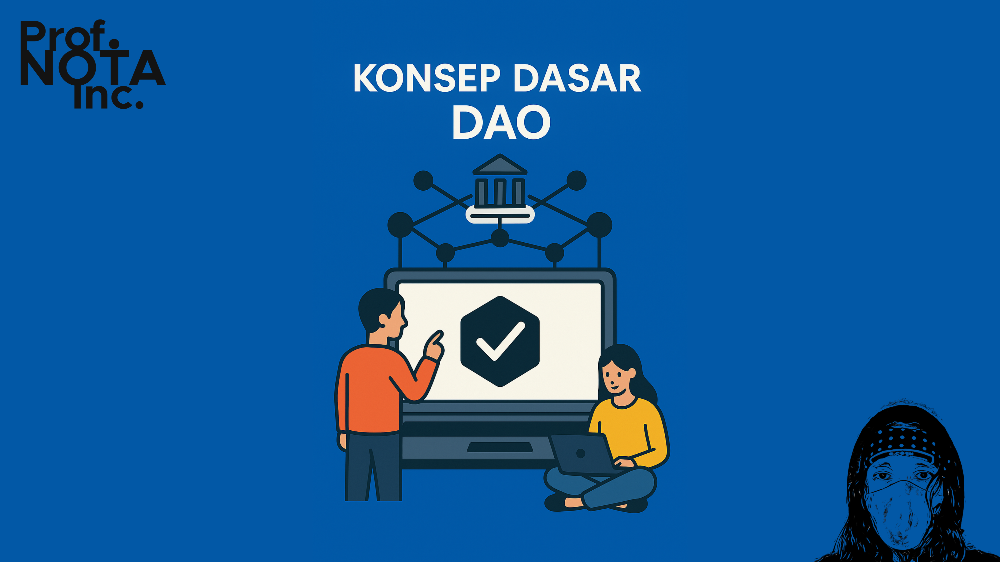
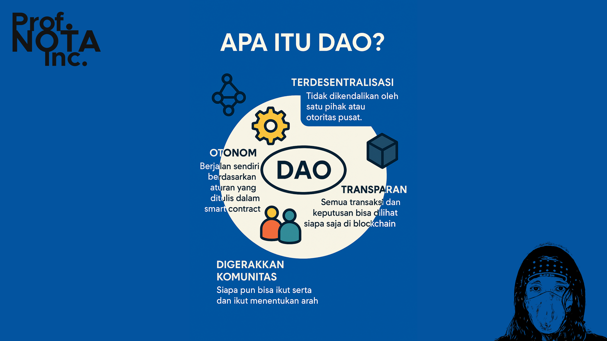
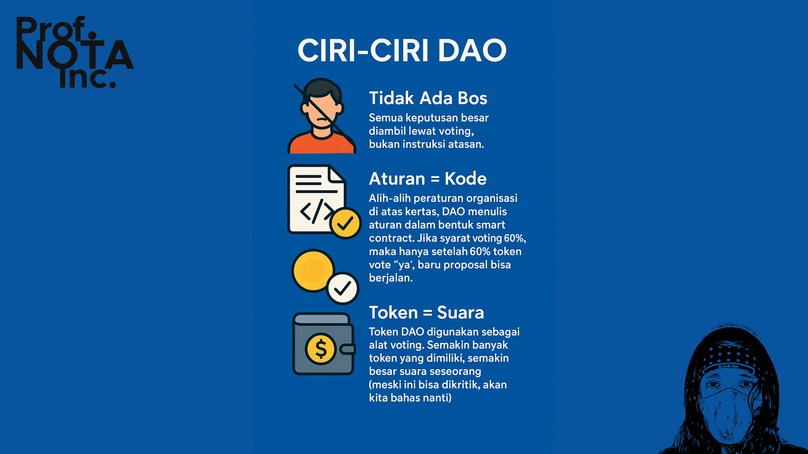
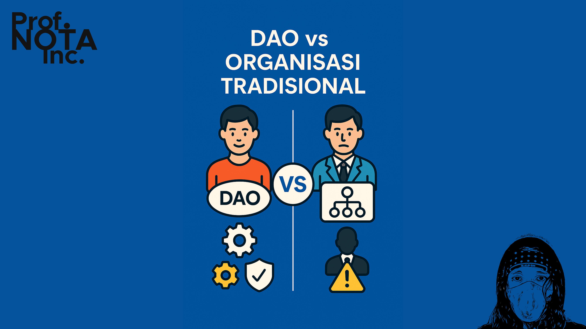
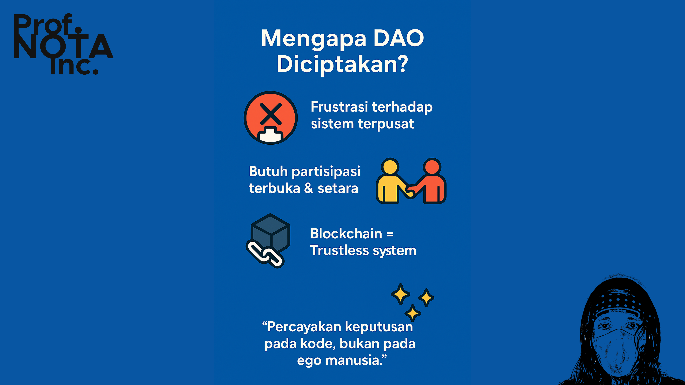

# ☕ Bagian 01

Bayangkan sebuah koperasi digital.

Semua anggota bisa menyampaikan ide. Semua keputusan diambil bersama. Tidak ada bendahara yang bisa “hilang entah ke mana” membawa kas organisasi. Dan yang paling penting:

> **Semua aturan tidak hanya disepakati, tapi juga dikunci dalam kode.**

Itulah **DAO — Decentralized Autonomous Organization**.

<figure><figcaption>
Konsep Dasar DAO
</figcaption></figure>

***

#### 📌 **Apa Itu DAO?**

DAO adalah organisasi yang:

* **Terdesentralisasi** → Tidak dikendalikan oleh satu pihak atau otoritas pusat.
* **Otonom** → Berjalan sendiri berdasarkan aturan yang ditulis dalam _smart contract_.
* **Transparan** → Semua transaksi dan keputusan bisa dilihat siapa saja di blockchain.
* **Digerakkan komunitas** → Siapa pun bisa ikut serta dan ikut menentukan arah.

<figure><figcaption>
Apa Itu DAO?
</figcaption></figure>

***

#### 🧩 **Ciri-Ciri DAO**

1. **Tidak Ada Bos**\
   Semua keputusan besar diambil lewat _voting_, bukan instruksi atasan.
2. **Aturan = Kode**\
   Alih-alih peraturan organisasi di atas kertas, DAO menulis aturan dalam bentuk _smart contract_. Jika syarat voting 60%, maka hanya setelah 60% token vote “ya”, baru proposal bisa berjalan.
3. **Token = Suara**\
   Token DAO digunakan sebagai alat voting. Semakin banyak token yang dimiliki, semakin besar suara seseorang (meski ini bisa dikritik, akan kita bahas nanti).
4. **Dana Kolektif = Treasury**\
   Uang organisasi disimpan dalam dompet bersama (smart contract wallet) yang hanya bisa dibuka jika proposal disetujui oleh pemilik token.

<figure><figcaption>
Ciri-Ciri DAO
</figcaption></figure>

***

#### ⚖️ DAO vs Organisasi Tradisional

| Aspek              | Organisasi Tradisional       | DAO                                     |
| ------------------ | ---------------------------- | --------------------------------------- |
| Pusat Keputusan    | Manajemen atau direktur      | Komunitas lewat voting                  |
| Struktur Hierarkis | Ya                           | Tidak — setara dan partisipatif         |
| Aturan Organisasi  | AD/ART, manual, hukum negara | Smart Contract di blockchain            |
| Transparansi       | Terbatas                     | Penuh — semua bisa dicek on-chain       |
| Eksekusi Keputusan | Manual, lewat birokrasi      | Otomatis lewat kode (jika voting lolos) |

<figure><figcaption>
DAO vs Organisasi Tradisional
</figcaption></figure>

***

#### 🧠 **Mengapa DAO Diciptakan?**

DAO lahir dari:

* Kekecewaan terhadap organisasi terpusat yang sering tidak transparan.
* Kebutuhan akan partisipasi terbuka dan setara.
* Kemampuan baru yang ditawarkan blockchain untuk membuat keputusan dan transaksi _trustless_ (tanpa harus saling percaya secara pribadi).

DAO memberi janji baru:

> “Jika kita tidak bisa percaya manusia 100%, maka percayakan keputusannya pada kode yang disepakati bersama.”

<figure><figcaption>
Mengapa DAO Diciptakan?
</figcaption></figure>

***

#### 📚 Catatan:

DAO bukan berarti semua bisa sembarangan memutuskan. Justru, sistem ini dirancang agar **semua keputusan besar harus melalui proses terbuka dan sistematis**.

Kalau Anda pernah:

* Tidak diajak rapat meski ikut iuran.
* Geram karena dana kegiatan dipakai di luar kesepakatan.
* Ingin menyampaikan ide tapi tak tahu ke siapa.

Maka DAO bisa menjadi jawaban baru — _organisasi dengan suara anggota sebagai motor utama, dan kode sebagai pelindung bersama._

***

P.S. Read this document freely for information and guidance. Do not redistribute or restate—no quotes, summaries, paraphrases, or derivatives—without prior written permission from [**Prof. NOTA**](https://nota.endhonesa.com/). Sharing the link is allowed. So, share the link, not the text. Do not discuss or re-tell the contents in any form—written, spoken, or recorded—without prior written permission.

***
