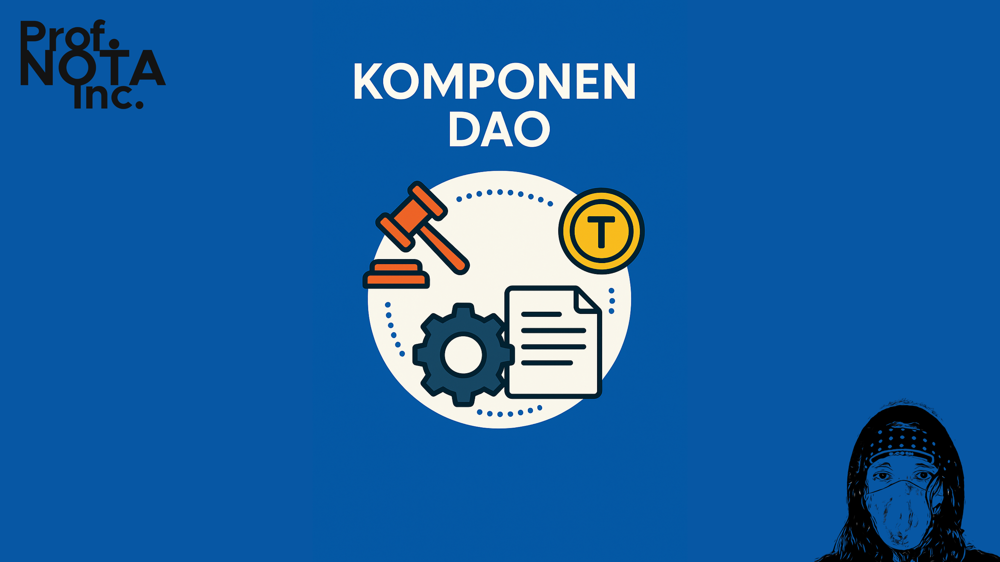
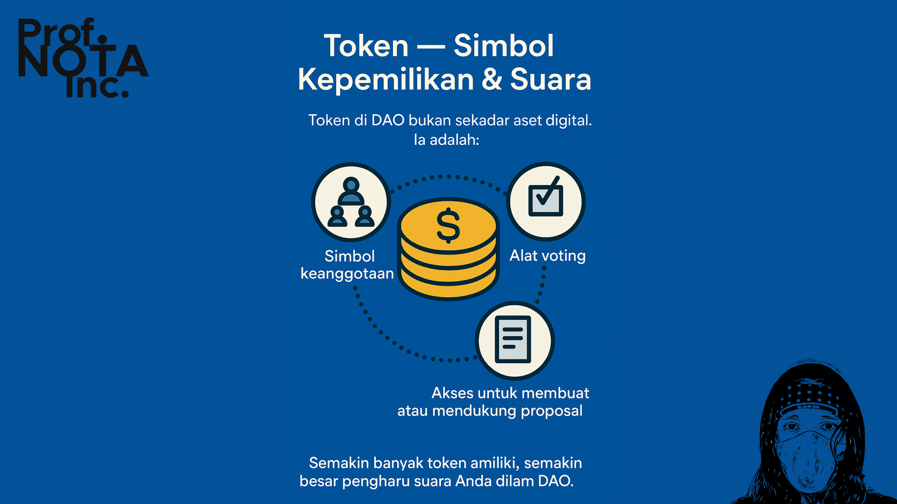
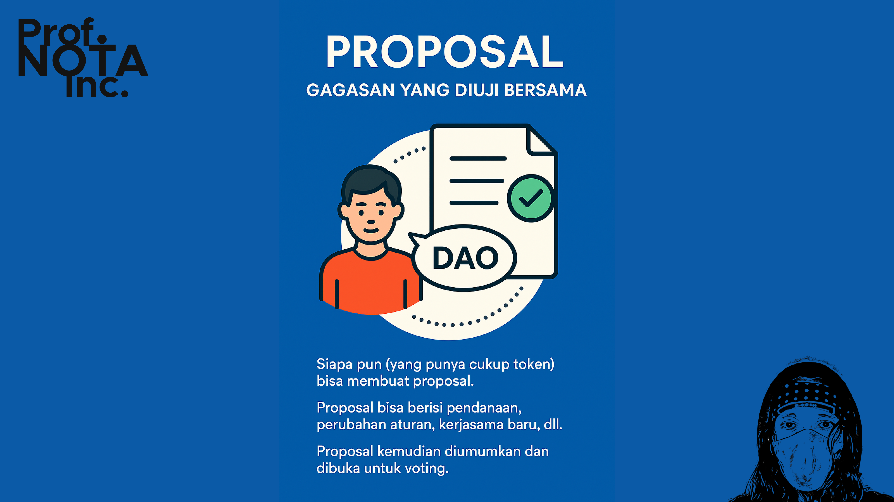
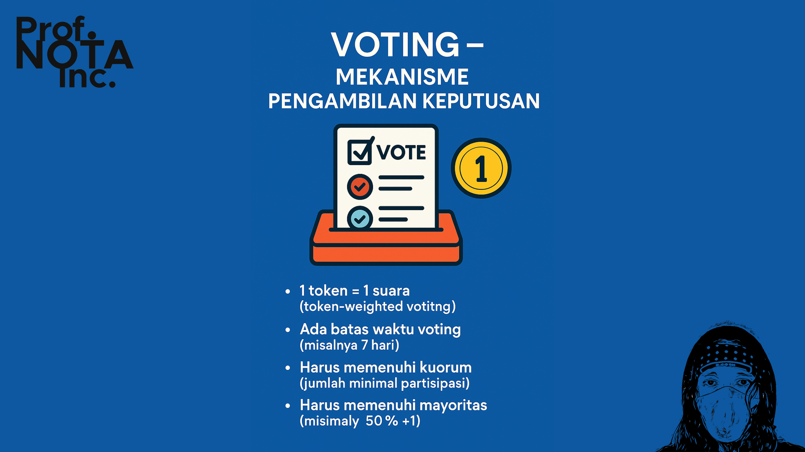
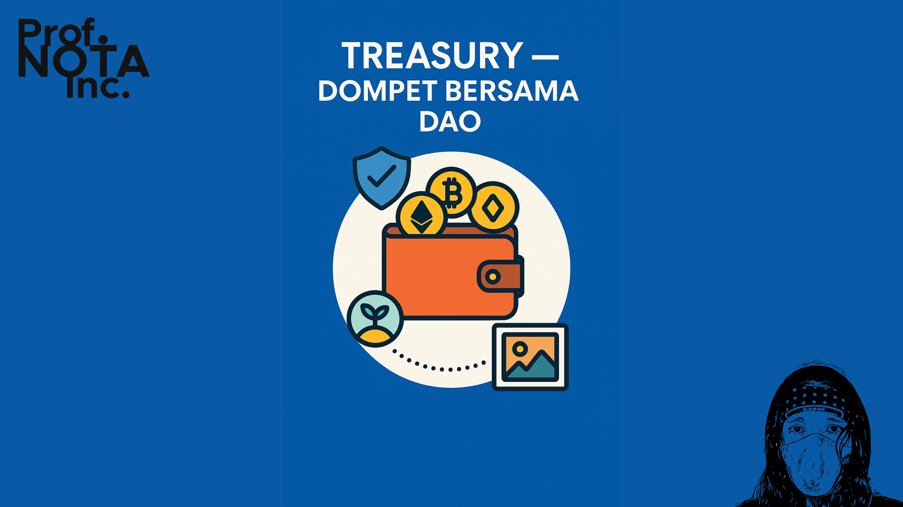
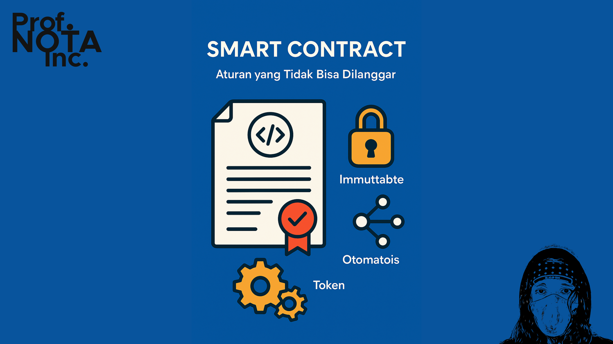

# 🔏 Bagian 02

DAO, seperti tubuh manusia, hanya bisa berjalan kalau organ-organnya bekerja bersama. Di DAO, _organ-organ_ ini tidak terlihat secara fisik, tapi semuanya hidup di atas jaringan blockchain.

Mari kita sama-sama lihat komponen utamanya.

<figure><figcaption>
Komponen DAO
</figcaption></figure>

***

#### 🪙 **1. Token — Simbol Kepemilikan & Suara**

Token di DAO bukan sekadar _aset digital_. Ia adalah:

* **Simbol keanggotaan**
* **Alat voting**
* **Akses untuk membuat atau mendukung proposal**

Jenis token biasanya:

* **ERC-20** → untuk governance umum
* **NFT (ERC-721/1155)** → bisa jadi simbol keanggotaan eksklusif

Semakin banyak token Anda miliki, semakin besar _pengaruh suara_ Anda dalam DAO. Tapi ini bisa membawa masalah jika tidak diatur (nanti dibahas di bagian Tantangan DAO).

<figure><figcaption>
Token - Simbol Kepemilikan &#x26; Suara
</figcaption></figure>

***

#### 🗳️ **2. Proposal — Gagasan yang Diuji Bersama**

Semua keputusan besar dimulai dari **proposal**:

* Siapa pun (yang punya cukup token) bisa membuat proposal.
* Proposal bisa berisi: pendanaan, perubahan aturan, kerjasama baru, dll.
* Proposal kemudian diumumkan dan dibuka untuk voting.

Biasanya ada _periode diskusi_, lalu _periode voting_, agar setiap anggota DAO bisa membaca dan mempertimbangkan dengan matang.

<figure><figcaption>
Proposal - Gagasan yang Diuji Bersama
</figcaption></figure>

***

#### 📈 **3. Voting — Mekanisme Pengambilan Keputusan**

Sistem voting DAO bisa berbeda-beda, tapi prinsip umumnya:

* 1 token = 1 suara (token-weighted voting)
* Ada batas waktu voting (misalnya 7 hari)
* Harus memenuhi **kuorum** (jumlah minimal partisipasi)
* Harus memenuhi **mayoritas** (misalnya 50% +1)

DAO bisa memilih:

* **Simple majority** (51% setuju = jalan)
* **Supermajority** (67% atau lebih untuk perubahan besar)
* **Quadratic voting** (melawan dominasi whale, dibahas nanti)

Semua hasil voting dieksekusi otomatis atau disiapkan untuk eksekusi oleh smart contract.

<figure><figcaption>
Voting - Mekanisme Pengambilan Suara
</figcaption></figure>

***

#### 🏦 **4. Treasury — Dompet Bersama DAO**

Inilah **“uang kas organisasi”**, tapi disimpan dalam bentuk kripto (ETH, OiOi, dll.) di smart contract yang:

* Hanya bisa diakses lewat hasil proposal yang disetujui.
* Semua transaksi tercatat secara terbuka (on-chain).
* Tidak bisa diubah atau dicuri sepihak oleh siapa pun.

Contoh penggunaan:

* Mendanai proyek komunitas
* Membayar developer open source
* Membeli aset kolektif (seperti NFT, domain, atau IP)

<figure><figcaption>
Treasury - Dompet Bersama DAO
</figcaption></figure>

***

#### ⚙️ **5. Smart Contract — Aturan yang Tidak Bisa Dilanggar**

Semua logika DAO, mulai dari proposal, voting, hingga pencairan dana, **ditulis dalam smart contract**.

Smart contract ini bersifat:

* **Immutable** (tidak bisa diubah semaunya setelah diluncurkan)
* **Terbuka** (siapa saja bisa melihat isi kodenya)
* **Otomatis** (mengeksekusi hasil voting tanpa campur tangan manusia)

Kalau aturan ditulis:

> “Jika 60% suara mendukung, maka kirim 100 ETH ke wallet pengembang,”\
> maka sistem akan melakukannya tanpa bisa dibatalkan oleh siapa pun — kecuali aturan diubah lewat proposal baru.

<figure><figcaption>
Smart Contract - Aturan yang Tidak Bisa Dilanggar
</figcaption></figure>

***

Dengan semua komponen ini, DAO bisa berjalan tanpa kantor, tanpa bos, tanpa korupsi. Tapi, apakah semuanya sesederhana itu?

Mari kita telusuri **Bagian 3: Cara Kerja DAO** — dan lihat bagaimana semua komponen ini bersinergi dalam praktik.

***
