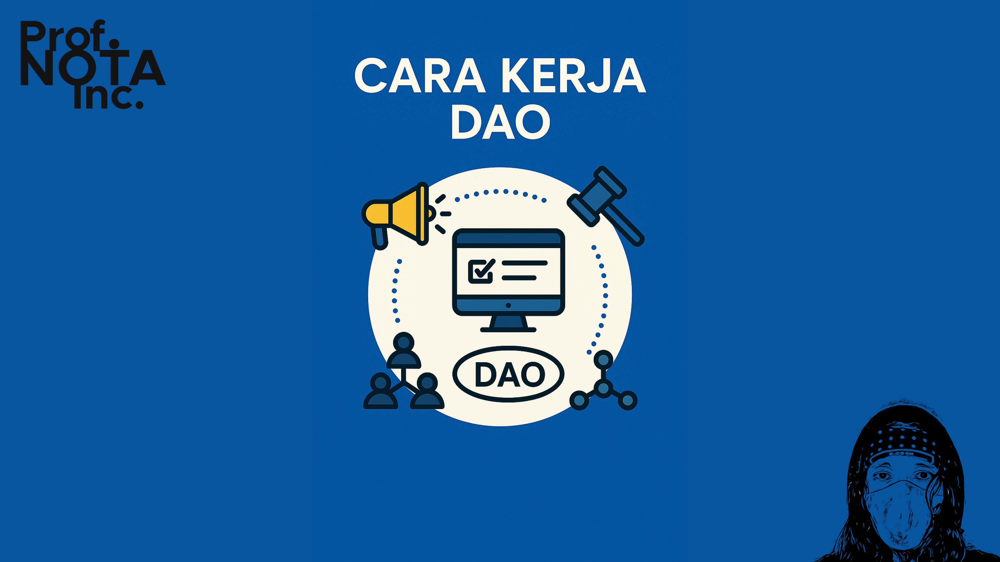
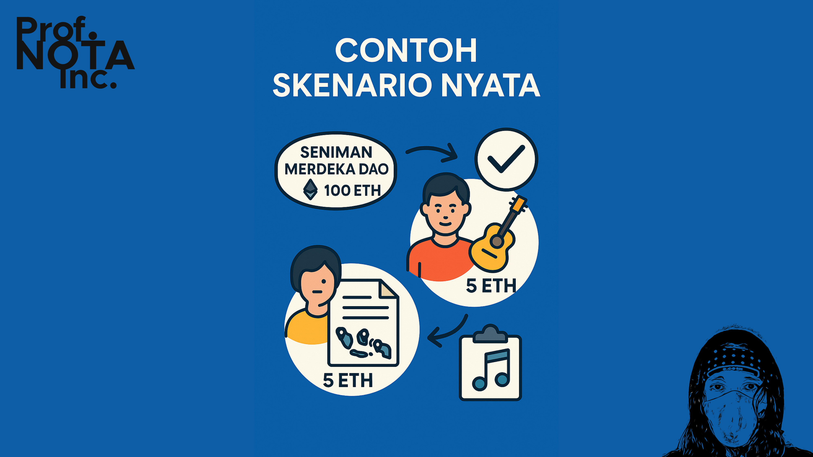
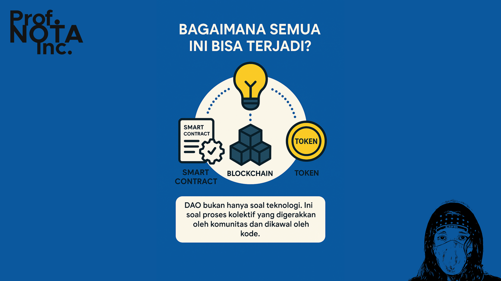
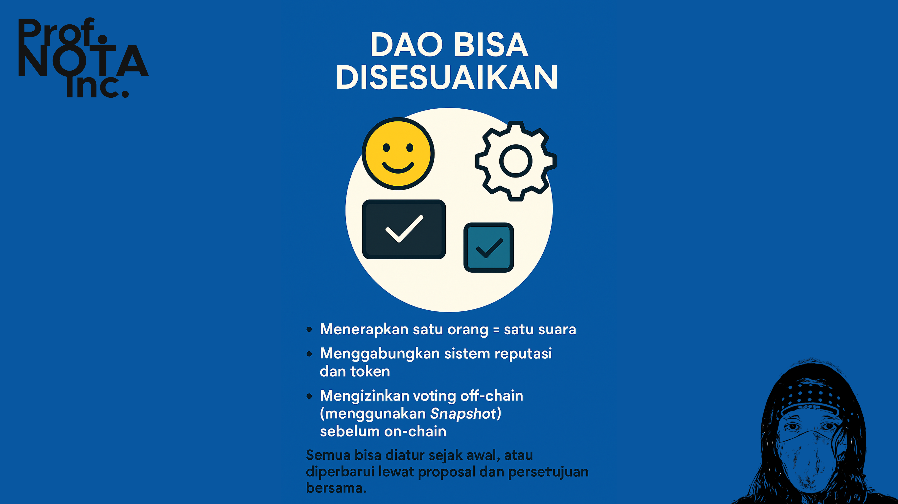

# 📜 Bagian 03

DAO bisa terdengar seperti sesuatu dari masa depan — organisasi tanpa pemimpin, dompet bersama yang tak bisa disentuh, dan keputusan yang berjalan sendiri lewat kode.

Tapi bagaimana sebenarnya **DAO bekerja dari awal hingga akhir**?

<figure><figcaption>
Cara Kerja DAO
</figcaption></figure>

***

#### 🧭 **Langkah Umum dalam Sebuah DAO**

Bayangkan kamu dan komunitasmu ingin membentuk DAO untuk mendanai proyek seni:

1. **Membuat DAO**\
   Gunakan platform seperti [Aragon](https://aragon.org/), [Juicebox](https://juicebox.money/), [DAOhaus](https://daohaus.club/), atau [Tally](https://www.tally.xyz/) untuk membentuk DAO.
   * Pilih nama DAO
   * Rancang aturan voting
   * Tentukan siapa yang boleh membuat proposal
   * Buat smart contract DAO
2. **Distribusi Token**
   * Token dibagikan kepada anggota komunitas
   * Bisa dibagikan gratis, dijual, atau ditukar dengan kontribusi (contoh: 1 lukisan = 100 token)
3. **Pengajuan Proposal**\
   Seorang anggota ingin menggunakan dana DAO untuk menyewa galeri seni. Ia membuat proposal:
   * Judul: _Sewa Galeri untuk Pameran Kolektif_
   * Dana diminta: 10 ETH
   * Rencana pelaksanaan: tanggal, tempat, tujuan
4. **Voting Proposal**\
   Seluruh anggota DAO membaca proposal dan memberikan suara:
   * Jika voting berlangsung selama 7 hari, maka semua punya waktu mempertimbangkan
   * Voting dilakukan on-chain (melalui antarmuka yang terhubung ke smart contract)
   * Jika kuorum dan mayoritas tercapai → proposal **disetujui**
5. **Eksekusi Otomatis**\
   Setelah proposal disetujui:
   * Smart contract otomatis mengirim 10 ETH ke wallet panitia
   * Semua langkah ini terekam dan dapat dilacak
6. **Laporan & Akuntabilitas**
   * Dana sudah cair, galeri sudah disewa
   * Tim memberikan laporan, bahkan bisa mengirim proposal lanjutan
   * Jika laporan tak sesuai, reputasi pembuat proposal bisa turun (DAO tertentu punya sistem reputasi)

<figure><figcaption>
Langkah Umum Dalam Sebuah DAO
</figcaption></figure>

***

#### 📚 **Contoh Skenario Nyata**

> DAO yang bernama “Seniman Merdeka DAO” memiliki treasury 100 ETH.
>
> Seorang anggota mengusulkan 5 ETH untuk mendanai pertunjukan musik jalanan di 5 kota.
>
> Proposal disetujui oleh 70% token voter.
>
> Dana cair otomatis, dan hasilnya didokumentasikan untuk evaluasi.
>
> Semua bisa dilihat siapa pun, tanpa rapat tertutup, tanpa tanda tangan fisik.

<figure><figcaption>
Contoh Skenario DAO
</figcaption></figure>

***

#### 🧠 **Bagaimana Semua Ini Bisa Terjadi?**

Kuncinya:

* **Smart Contract** → mengatur alur proposal, voting, dan eksekusi
* **Blockchain** → mencatat semua transaksi dan hasil voting
* **Token** → menjadi “kunci suara” bagi para anggota DAO

DAO bukan hanya soal teknologi. Ini soal **proses kolektif** yang digerakkan oleh komunitas dan dikawal oleh kode.

<figure><figcaption>
Bagaimana Mekanisme DAO Bisa Terjadi
</figcaption></figure>

***

#### 🛠️ DAO Bisa Disesuaikan

Tidak semua DAO bekerja persis sama. DAO bisa:

* Menerapkan satu orang = satu suara
* Menggabungkan sistem reputasi dan token
* Mengizinkan voting off-chain (menggunakan Snapshot) sebelum on-chain

Semua bisa diatur sejak awal, atau diperbarui lewat proposal dan persetujuan bersama.

<figure><figcaption>
DAO Bisa Disesuaikan
</figcaption></figure>

***

DAO bukan tanpa batas — tapi yang pasti, ia membuka **ruang baru untuk keadilan organisasi**. Bukan dengan menghapus kepemimpinan, tapi dengan **meredistribusi pengaruh dan kontrol**.

***

P.S. Read this document freely for information and guidance. Do not redistribute or restate—no quotes, summaries, paraphrases, or derivatives—without prior written permission from [**Prof. NOTA**](https://nota.endhonesa.com/). Sharing the link is allowed. So, share the link, not the text. Do not discuss or re-tell the contents in any form—written, spoken, or recorded—without prior written permission.

***
