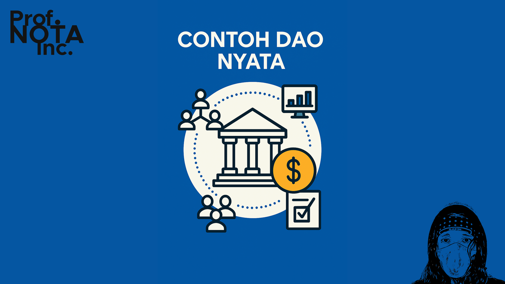
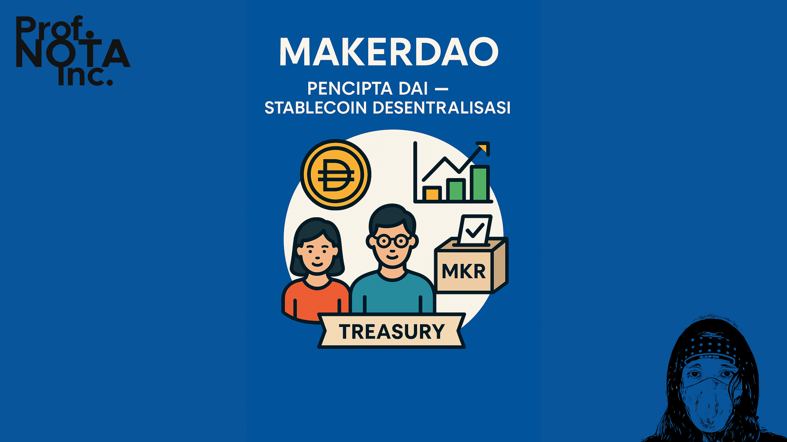
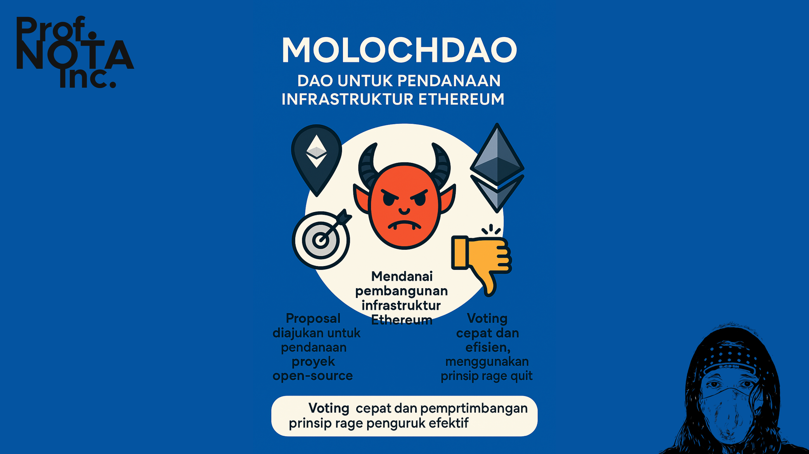
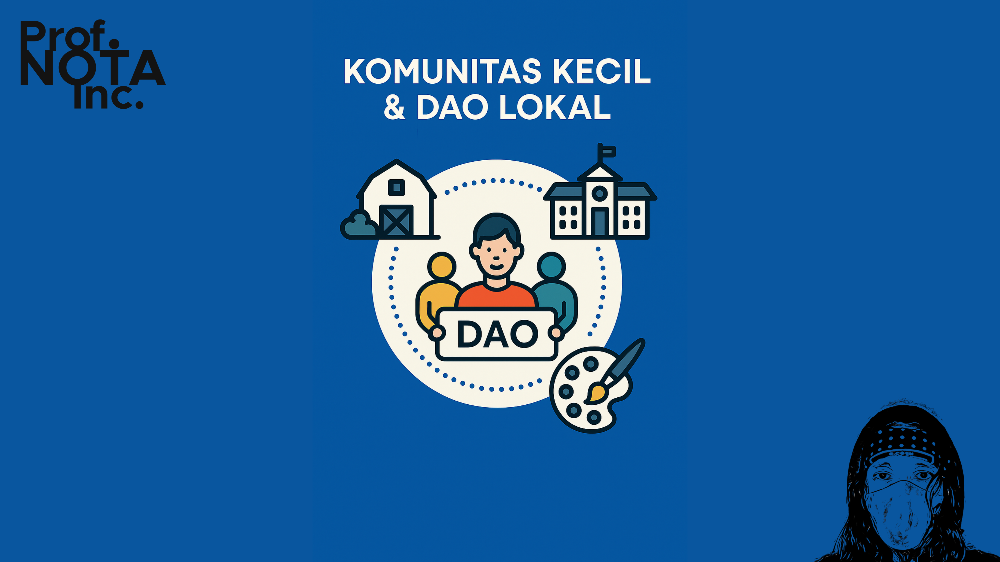

# 💡 Bagian 04

DAO bukan lagi mimpi para idealis digital. Ia sudah hidup — dan dalam banyak kasus, sudah mengelola aset jutaan dolar, mendanai proyek besar, bahkan membentuk arah kebijakan protokol blockchain besar.

Mari kita berkenalan dengan beberapa contoh DAO yang nyata, dari yang legendaris hingga yang masih eksperimental.

<figure><figcaption>
Contoh Nyata DAO
</figcaption></figure>

***

#### 🏛️ **1. The DAO (2016)**

📍 _Ethereum, Legenda dan Pelajaran Pahit_

Inilah DAO pertama yang namanya hanya: **“The DAO”**

Tujuannya sederhana: menciptakan dana ventura yang dikelola komunitas — tanpa manajer.

* Raised: >$150 juta ETH dari publik
* Voting dilakukan oleh pemilik token DAO
* Setiap proposal pendanaan harus disetujui kolektif

🚨 Namun, The DAO diretas.

Bug dalam kode smart contract dimanfaatkan untuk mencuri ±$60 juta ETH. Komunitas Ethereum akhirnya melakukan **hard fork** untuk mengembalikan dana — dan inilah yang memisahkan Ethereum dan Ethereum Classic.

**Pelajaran:**

> DAO butuh keamanan smart contract setingkat protokol, bukan sekadar idealisme.

<figure><figcaption>
The DAO
</figcaption></figure>

***

#### 🦊 **2. MakerDAO**

📍 _Pencipta DAI — Stablecoin Desentralisasi_

MakerDAO mengelola **DAI**, salah satu stablecoin terbesar di dunia. Alih-alih dikendalikan oleh perusahaan, DAI dikendalikan oleh **governance token**: $MKR.

* Pemilik MKR bisa mengusulkan dan memilih kebijakan baru
* Contoh: mengubah bunga pinjaman, menambah jenis jaminan (collateral)
* Treasury digunakan untuk membayar auditor, pengembang, dan komunitas

MakerDAO menunjukkan bahwa **DAO bisa mengelola sistem keuangan yang kompleks** dengan stabil.

<figure><figcaption>
MakerDAO
</figcaption></figure>

***

#### 🧠 **3. MolochDAO**

📍 _DAO untuk Pendanaan Infrastruktur Ethereum_

Tujuan MolochDAO sangat spesifik:

Mendanai pembangunan infrastruktur Ethereum (yang sering diabaikan karena tidak “seksi”)

* Proposal diajukan untuk pendanaan proyek open-source
* Voting cepat dan efisien, menggunakan prinsip _rage quit_ (jika tak setuju, bisa keluar dengan bagian dana Anda)
* Telah mendanai banyak proyek seperti ETH 2.0 tooling, audit, dsb.

MolochDAO memperkenalkan arsitektur DAO yang sederhana tapi efektif.

<figure><figcaption>
MolochDAO
</figcaption></figure>

***

#### 🖼️ **4. Nouns DAO**

📍 _NFT sebagai Anggota Parlemen_

Nouns DAO menciptakan 1 NFT “Noun” setiap hari —\
Setiap Noun = 1 suara di DAO.\
Harga lelang bisa mencapai ratusan ribu dolar.

* Semua dana dari penjualan NFT masuk ke treasury DAO
* Proposal diajukan oleh pemilik Noun, seperti:
  * Mendanai film animasi
  * Mengadakan kompetisi seni
  * Membiayai advokasi open-source

**Nouns DAO mengubah NFT dari koleksi menjadi instrumen tata kelola.**

<figure><figcaption>
Nouns DAO
</figcaption></figure>

***

#### 🧑‍🤝‍🧑 **5. CityDAO**

📍 _Membeli Tanah Nyata secara Kolektif_

CityDAO membeli tanah di Wyoming, AS —

…bukan atas nama seseorang, tapi atas nama DAO.

* Token “Citizen” memberi akses untuk voting
* Setiap keputusan soal penggunaan tanah diputuskan bersama
* Eksperimen ini sedang menjelajahi legalitas DAO sebagai “pemilik properti”

CityDAO adalah penggabungan DAO dengan real-world asset.

<figure><figcaption>
CityDAO
</figcaption></figure>

***

#### 🧬 **6. Komunitas Kecil & DAO Lokal**

DAO tidak harus besar. Beberapa komunitas membentuk:

* DAO untuk pendanaan karya seni kolektif
* DAO untuk pengelolaan sekolah alternatif
* DAO untuk pembelian alat produksi komunitas (kamera, server, dlsb.)

Bayangkan:

> _Satu komunitas desa bisa membentuk DAO untuk mengelola irigasi atau distribusi hasil panen secara adil._

Inilah impian DAO:

**Organisasi dari bawah, oleh anggota, untuk anggota.**

<figure><figcaption>
DAO LOKAL
</figcaption></figure>

***

Setelah melihat contoh-contoh ini, kita mulai bisa bertanya:

> “Kalau DAO bisa mengelola keuangan, properti, bahkan NFT, bisakah kita membayangkan DAO yang mengelola pendidikan, budaya, atau bahkan pemerintahan?”

Jawabannya: **bisa.**

Tapi tentu saja, tidak tanpa tantangan.

Mari kita lanjut ke **Bagian 5: Tantangan dan Kritik terhadap DAO**.

***

P.S. Read this document freely for information and guidance. Do not redistribute or restate—no quotes, summaries, paraphrases, or derivatives—without prior written permission from [**Prof. NOTA**](https://nota.endhonesa.com/). Sharing the link is allowed. So, share the link, not the text. Do not discuss or re-tell the contents in any form—written, spoken, or recorded—without prior written permission.

***
