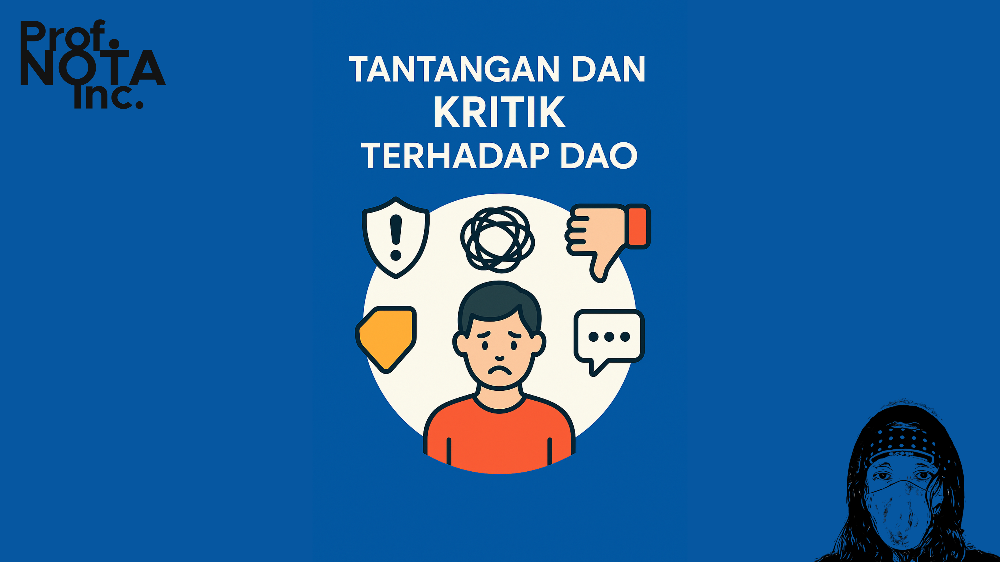
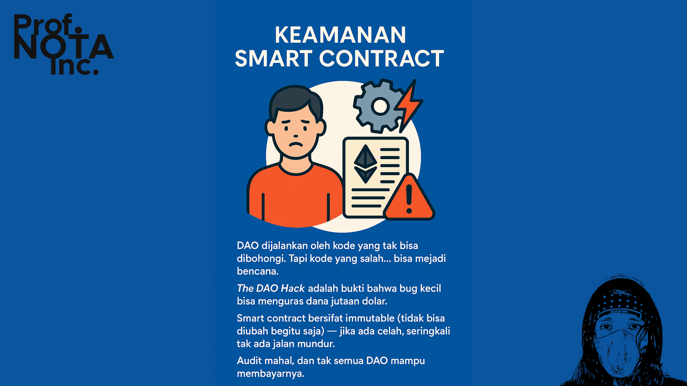
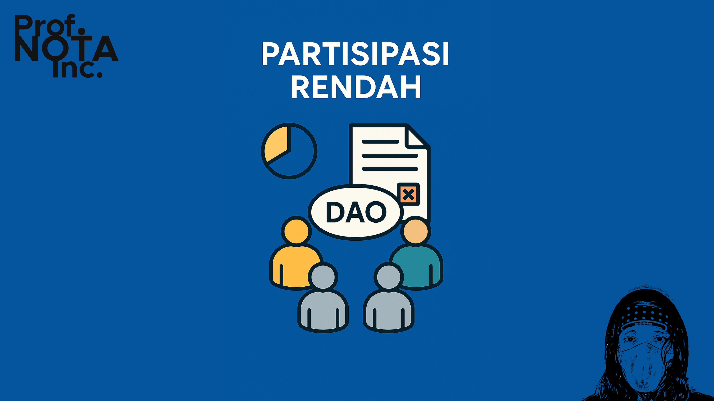
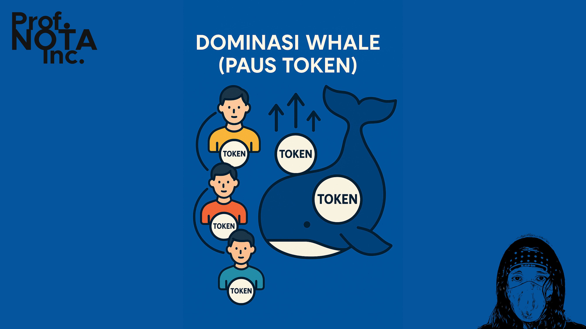
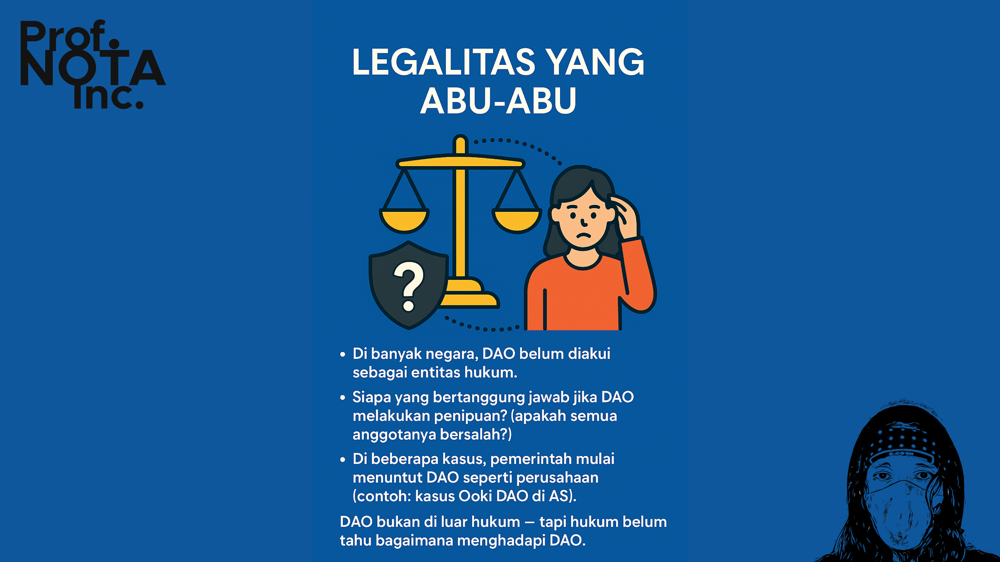
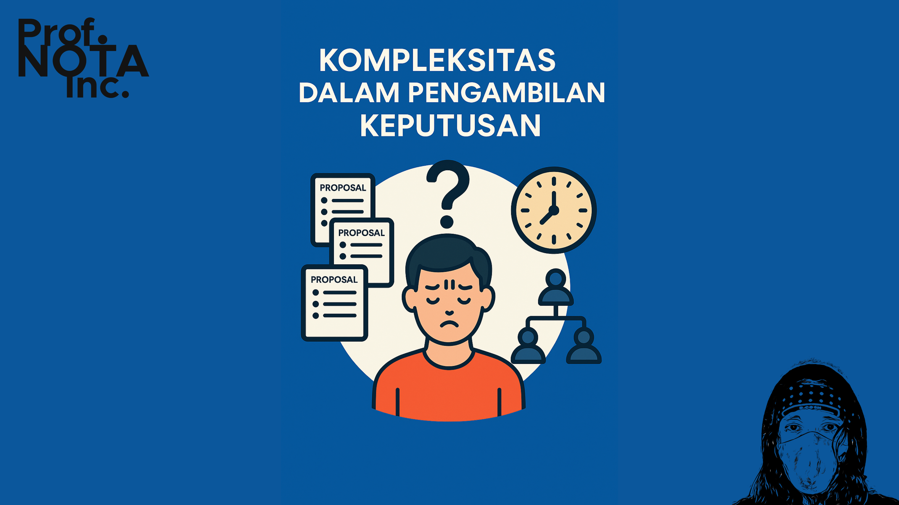
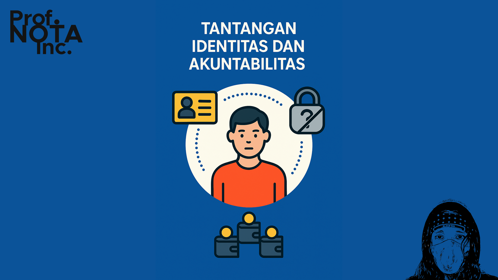
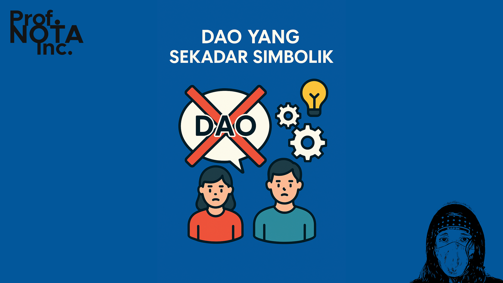

# 🧑‍🌾 Bagian 05

DAO sering dipuja sebagai simbol masa depan organisasi: adil, transparan, tanpa bos.

Tapi seperti halnya teknologi lain yang penuh janji, DAO juga membawa **masalah-masalah baru** — bukan hanya teknis, tapi juga sosial, politik, dan etika.

<figure><figcaption>
Tantangan dan Kritik terhadap DAO
</figcaption></figure>

***

#### ⚠️ **1. Keamanan Smart Contract**

DAO dijalankan oleh _kode yang tak bisa dibohongi_. Tapi kode yang salah… bisa menjadi bencana.

* _The DAO Hack_ adalah bukti bahwa bug kecil bisa menguras dana jutaan dolar.
* Smart contract bersifat immutable (tidak bisa diubah begitu saja) — jika ada celah, seringkali tak ada jalan mundur.
* Audit mahal, dan tak semua DAO mampu membayarnya.

**Catatan:** DAO yang paling sukses selalu menyisihkan anggaran untuk audit, dan membuat _tim penjaga protokol_.

<figure><figcaption>
Keamanan Smart Contract
</figcaption></figure>

***

#### 📉 **2. Partisipasi Rendah**

DAO membuka partisipasi bagi siapa saja… tapi ternyata, tidak semua orang ingin (atau sempat) berpartisipasi.

* Banyak proposal DAO hanya di-vote oleh 5–10% pemilik token.
* Mayoritas hanya “memegang token” sebagai investasi, bukan sebagai alat demokrasi.
* Proposal besar bisa lolos atau gagal hanya karena kurang partisipasi, bukan karena buruk atau baiknya isi.

**Ini adalah ironi:**

Semakin besar DAO, seringkali partisipasi semakin turun — dan akhirnya kembali dikendalikan oleh minoritas aktif.

<figure><figcaption>
Partisipasi Rendah
</figcaption></figure>

***

#### 🐋 **3. Dominasi Whale (Paus Token)**

> “1 token = 1 suara” terdengar adil.
>
> Tapi bagaimana jika seseorang memiliki 1 juta token, dan lainnya hanya 10 token?

* DAO bisa dikuasai oleh para “whale” yang membeli banyak token.
* Voting bisa berubah jadi plutokrasi: yang kaya, yang berkuasa.
* Proposal yang masuk akal bisa kalah karena tidak didukung oleh elite token.

Solusi seperti **quadratic voting** mulai digunakan, tapi belum lazim dan punya tantangan tersendiri.

<figure><figcaption>
Dominasi Whale - Paus Token
</figcaption></figure>

***

#### ⚖️ **4. Legalitas yang Abu-abu**

DAO menabrak batas-batas sistem hukum:

* Di banyak negara, DAO **belum diakui sebagai entitas hukum**.
* Siapa yang bertanggung jawab jika DAO melakukan penipuan? (apakah semua anggotanya bersalah?)
* Di beberapa kasus, pemerintah mulai menuntut DAO seperti perusahaan (contoh: kasus _Ooki DAO_ di AS).

**DAO bukan di luar hukum — tapi hukum belum tahu bagaimana menghadapi DAO.**

<figure><figcaption>
Legalitas yang Abu-Abu
</figcaption></figure>

***

#### 🧩 **5. Kompleksitas dalam Pengambilan Keputusan**

Demokrasi butuh proses. Tapi ketika semua harus divote:

* Pengambilan keputusan bisa lambat
* Banyak proposal teknis terlalu rumit untuk dipahami rata-rata anggota
* Bisa muncul “fatigue” — anggota lelah membaca dan memilih

Akhirnya, banyak DAO membentuk **working group atau sub-komite** — mirip seperti “departemen” dalam organisasi tradisional.

DAO pun diam-diam menciptakan kembali struktur lama, tapi dengan wajah baru.

<figure><figcaption>
Kompleksitas Dalam Pengambilan Keputusan
</figcaption></figure>

***

#### 🤖 **6. Tantangan Identitas dan Akuntabilitas**

Karena DAO berbasis wallet dan pseudonim:

* Tidak semua anggota punya _track record_ atau identitas jelas
* Sulit membangun kepercayaan dalam proyek jangka panjang
* Penipuan atau manipulasi bisa dilakukan dengan banyak wallet (_Sybil attack_)

**Tantangan baru:**

Bagaimana menggabungkan **kebebasan anonimitas** dengan **tanggung jawab kolektif**?

<figure><figcaption>
Tantang Identitas dan Akuntabilitas
</figcaption></figure>

***

#### 🎭 **7. DAO yang Sekadar Simbolik**

Sayangnya, banyak DAO yang hanya DAO “di nama saja.”

* Voting tidak punya efek nyata
* Tim core tetap membuat semua keputusan
* Token hanya gimmick, bukan alat pengambilan keputusan

DAO seperti ini hanya memperdagangkan jargon “desentralisasi” untuk legitimasi, bukan sebagai prinsip sejati.

<figure><figcaption>
DAO yang Sekedar Simbolik
</figcaption></figure>

***

### 🧠 Catatan Reflektif:

DAO bukan solusi untuk semua masalah organisasi.

DAO adalah **alat** — dan seperti semua alat, nilainya tergantung pada niat, desain, dan cara kita menggunakannya.

Kritik terhadap DAO tidak berarti menolaknya. Justru, dengan memahami tantangannya, kita bisa merancang DAO yang **lebih manusiawi, inklusif, dan bijak**.

Selanjutnya, mari kita lihat ke depan:

> Bagaimana masa depan DAO?
>
> Dan apakah DAO bisa menjadi tulang punggung masyarakat masa depan?

Kita lanjutkan ke **Bagian 6: Masa Depan DAO**.

***
