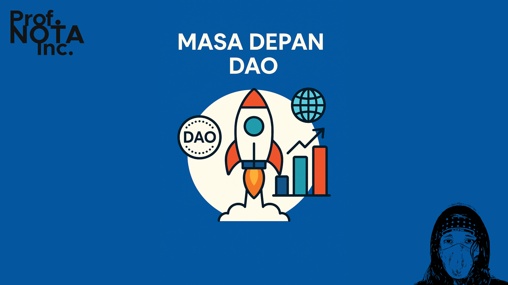
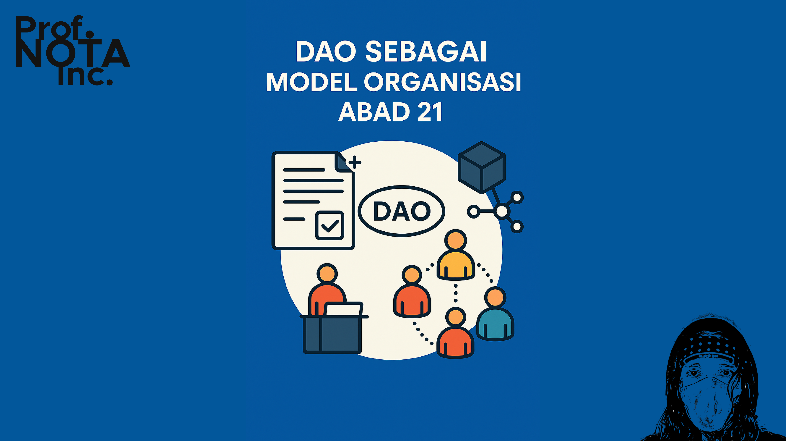
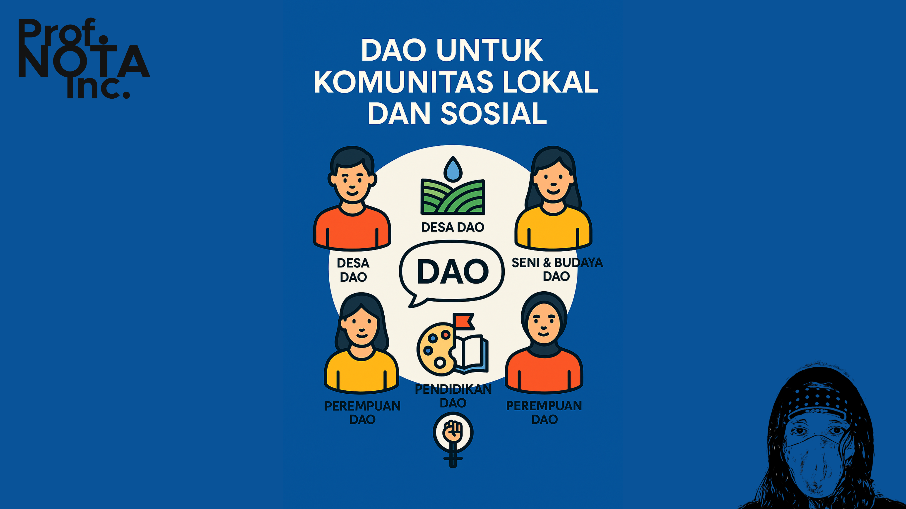
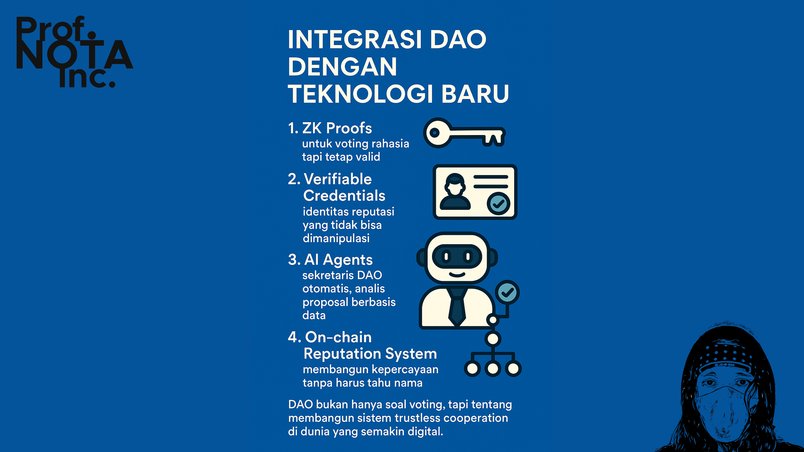
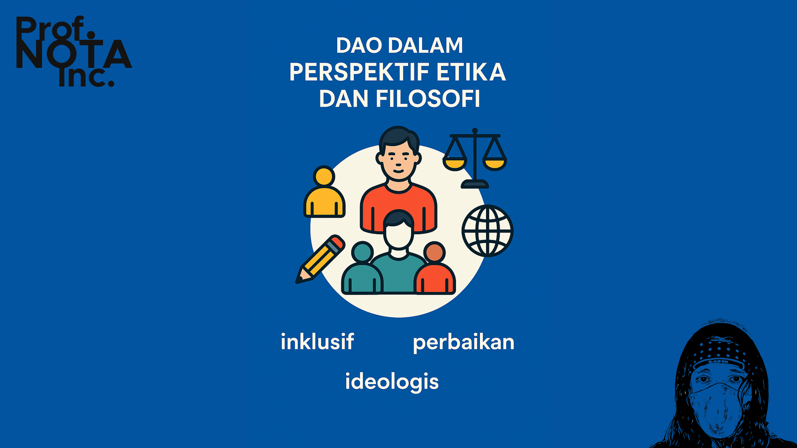
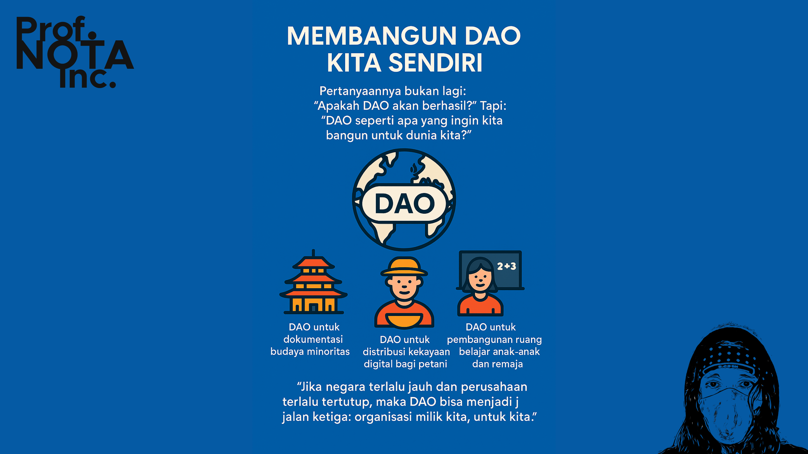

# 🔏 Bagian 06

DAO adalah eksperimen yang belum selesai. Tapi seperti api kecil yang menyala di gelap malam, ia memberi harapan baru:

> _Bisakah kita membangun organisasi yang adil, tanpa hierarki feodal?_
>
> _Bisakah kita mempercayakan urusan penting pada kode, bukan pada ego manusia?_

Jawaban dari pertanyaan itu… belum final. Tapi kita bisa melihat tanda-tandanya.

<figure><figcaption>
Masa Depan DAO
</figcaption></figure>

***

#### 🔮 **1. DAO Sebagai Model Organisasi Abad 21**

Di masa depan, organisasi mungkin tidak lagi berbentuk:

* Yayasan dengan surat izin dari negara,
* Perusahaan dengan direktur dan komisaris,
* Komunitas dengan ketua tetap.

Sebaliknya, organisasi bisa berupa:

* _Smart contract di blockchain_,
* Token sebagai keanggotaan,
* Keputusan kolektif yang transparan dan otomatis.

Kita sudah mulai melihat:

* DAO pekerja lepas (freelancer DAO),
* DAO pengelola dana beasiswa,
* DAO untuk pengarsipan pengetahuan rakyat,
* Bahkan DAO keluarga atau komunitas spiritual.

<figure><figcaption>
DAO Sebagai Model Organisasi Abad 21
</figcaption></figure>

***

#### 🌍 **2. DAO untuk Komunitas Lokal dan Sosial**

DAO tidak hanya untuk geek dan developer. Ia bisa menjadi alat pemberdayaan:

* **Desa DAO** → pengelolaan air, sawah, hasil panen secara kolektif
* **Seni & Budaya DAO** → seniman mengelola dana dan distribusi karya bersama
* **Pendidikan DAO** → kurikulum disusun dan dievaluasi bersama murid & guru
* **Perempuan DAO** → perlindungan sosial berbasis jaringan terdesentralisasi

DAO bisa menjadi wadah _revolusi mikro_, ketika masyarakat mengambil kembali kendali atas institusi yang selama ini jauh dari mereka.

<figure><figcaption>
DAO untuk Komunitas Lokal dan Sosial
</figcaption></figure>

***

#### 🤖 **3. Integrasi DAO dengan Teknologi Baru**

Masa depan DAO tidak bisa dipisahkan dari teknologi lainnya:

* **ZK Proofs** → untuk voting rahasia tapi tetap valid
* **Verifiable Credentials** → identitas reputasi yang tidak bisa dimanipulasi
* **AI Agents** → sekretaris DAO otomatis, analis proposal berbasis data
* **On-chain Reputation System** → membangun kepercayaan tanpa harus tahu nama

DAO bukan hanya soal voting, tapi tentang membangun sistem _trustless cooperation_ di dunia yang semakin digital.

<figure><figcaption>
Integrasi DAO Dengan Teknologi Baru
</figcaption></figure>

***

#### 🧬 **4. DAO dalam Perspektif Etika dan Filosofi**

Kita harus berhati-hati.

DAO bukan sekadar alat kekuasaan digital, bukan pula sarana investasi spekulatif.

> DAO seharusnya menjadi **bentuk baru dari kesepakatan sosial**.

Artinya:

* DAO harus inklusif, bukan elitis.
* DAO harus memberi ruang kesalahan dan perbaikan, bukan sekadar automatisme kaku.
* DAO harus dibangun dengan **kesadaran ideologis**, bukan hanya ketertarikan pada teknologi.

<figure><figcaption>
DAO Dalam Perspektif Etika dan Filosofi
</figcaption></figure>

***

#### 💡 **5. Membangun DAO Kita Sendiri**

Pertanyaannya bukan lagi: _“Apakah DAO akan berhasil?”_

Tapi: _“DAO seperti apa yang ingin kita bangun untuk dunia kita?”_

Bayangkan:

* DAO untuk dokumentasi budaya minoritas,
* DAO untuk distribusi kekayaan digital bagi petani,
* DAO untuk pembangunan ruang belajar anak-anak dan remaja.

> _“Jika negara terlalu jauh dan perusahaan terlalu tertutup, maka DAO bisa menjadi jalan ketiga: organisasi milik kita, untuk kita.”_

<figure><figcaption>
Membangun DAO Kita Sendiri
</figcaption></figure>

***

DAO bukan untuk semua orang. Tapi ia membuka kemungkinan bagi **orang-orang yang selama ini tak punya suara.**

Dan dalam semangat itulah, masa depan DAO bukan hanya tentang teknologi. Ia adalah tentang **harapan yang diprogram dalam sistem**.

***
