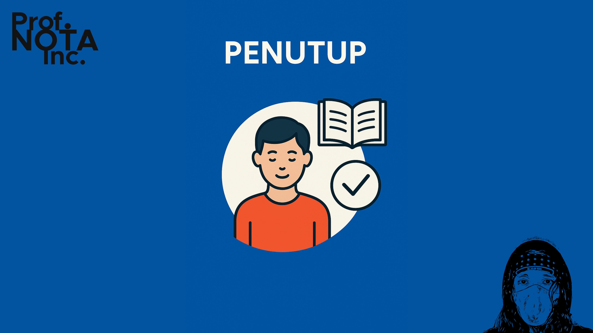
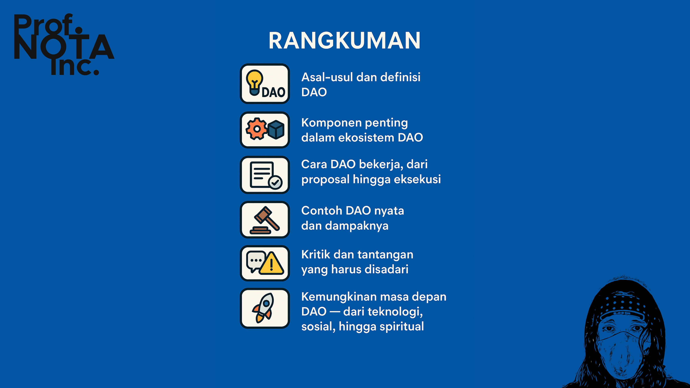
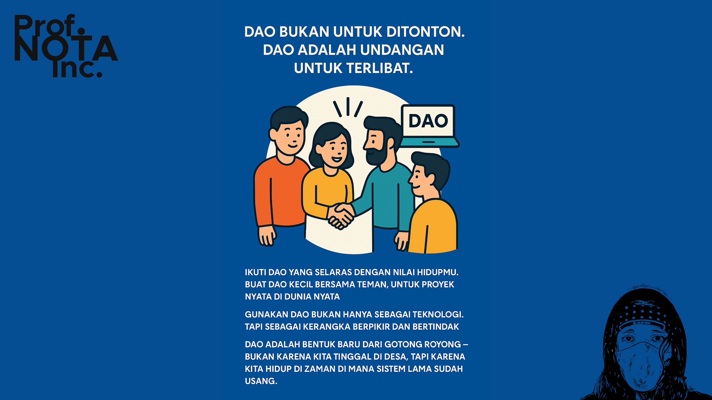
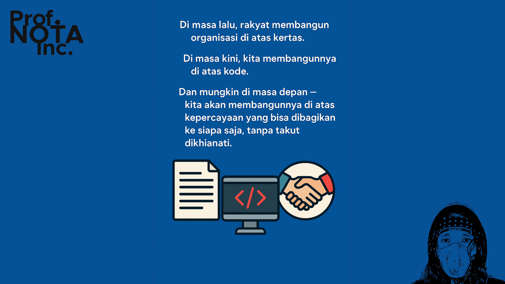
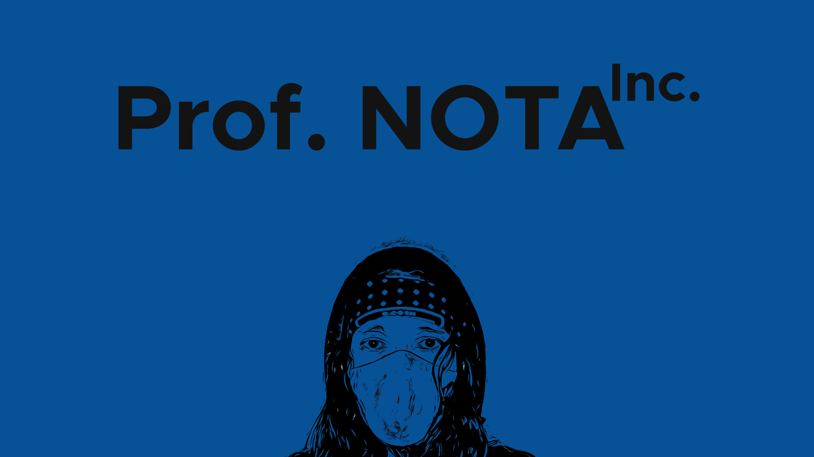

# 🔏 Bagian 07

DAO bukanlah akhir dari segala solusi.

Tapi ia memberi kita cara baru untuk bertanya:

> “Apakah kita masih butuh pemimpin yang tak bisa kita pilih?”
>
> “Apakah keputusan penting harus menunggu rapat yang tidak semua orang bisa hadiri?”
>
> “Bisakah organisasi berjalan bukan karena kekuasaan, tapi karena kesepakatan?”

Dengan DAO, kita tidak sedang mencari sistem yang sempurna.

Kita sedang membangun **ruang di mana siapa pun bisa ikut serta, tanpa harus meminta izin.**

<figure><figcaption>
Penutup dari Prof. NOTA
</figcaption></figure>

***

#### 📚 **Yang Telah Kita Pelajari**

Dalam materi ini, kita telah menelusuri:

* Asal-usul dan definisi DAO
* Komponen penting dalam ekosistem DAO
* Cara DAO bekerja, dari proposal hingga eksekusi
* Contoh DAO nyata dan dampaknya
* Kritik dan tantangan yang harus disadari
* Kemungkinan masa depan DAO — dari teknologi, sosial, hingga spiritual

<figure><figcaption>
Apa yang Telah Kita Pelajari
</figcaption></figure>

***

#### 🔥 **Sekarang Gilirannya Kita Semua**

DAO bukan untuk ditonton.

DAO adalah **undangan untuk terlibat**.

* Ikuti DAO yang selaras dengan nilai hidupmu.
* Buat DAO kecil bersama teman, untuk proyek nyata di dunia nyata.
* Gunakan DAO bukan hanya sebagai teknologi, tapi sebagai **kerangka berpikir dan bertindak**.

DAO adalah bentuk baru dari gotong royong — bukan karena kita tinggal di desa, tapi karena kita hidup di zaman di mana sistem lama sudah usang.

<figure><figcaption>
Sekarang Giliran Kita Semua
</figcaption></figure>

***

> Di masa lalu, rakyat membangun organisasi di atas kertas.
>
> Di masa kini, kita membangunnya di atas **kode.**
>
> Dan mungkin di masa depan — kita akan membangunnya di atas **kepercayaan yang bisa dibagikan ke siapa saja, tanpa takut dikhianati.**

<figure><figcaption>
Kepercayaan yang Bisa Dibagikan
</figcaption></figure>

***

📌 _Disusun oleh Prof. NOTA Inc., sebagai bagian dari upaya literasi desentralisasi untuk semua generasi._

<figure><figcaption>
Prof. NOTA Inc.
</figcaption></figure>

Seperti biasanya dan yang sudah-sudah… mohon apa yang sudah disampaikan di materi DAO ini dikonfirmasi dan divalidasi. Jika ternyata tidak valid, mohon diperbarui (di-update) agar [**Prof. NOTA**](https://prompt.straight-line.org/) bisa hadir dengan materi versi terbaru (high-end) di realitas kalian, kehidupan nyata kalian.

Sampai jumpa di DAO berikutnya.

Terima Kasih, #OiOi!

Salam,

[**Prof. NOTA**](https://nota.endhonesa.com/)\
\==== 47 =======

N.B. Semua materi edukasi ini selalu diperbarui dan telah digunakan dan disampaikan oleh [**Prof. NOTA**](https://nota.endhonesa.com/) di beberapa sesi kelas dan workshop tentang **Web3**, baik secara online maupun offline, di antaranya adalah:

* [**IDNFT Academy #1 - April hingga Juni 2022**](https://www.instagram.com/idnftacademy/)
* [**Web3 on Campus: Petra Christian University Surabaya - 17 April 2023**](https://web3campus.idnft.id/)
* **BANANOW Land - Class NOW - Sepanjang 2022 - 2023**
* [**Road to DevCon Ethereum 2024: Halo Ethereum - 7 Desember 2023**](https://pintu.co.id/news/61828-pintu-sponsori-event-halo-ethereum)

N.B. 2. Jika kamu merasa materi ini bermanfaat, **bagikan kepada temanmu**, komunitasmu, atau mereka yang sedang mencari cara baru untuk berorganisasi. Karena DAO bukan hanya untuk kita yang membaca ini — tapi untuk mereka yang belum tahu bahwa _organisasi juga bisa dibebaskan_.

***
